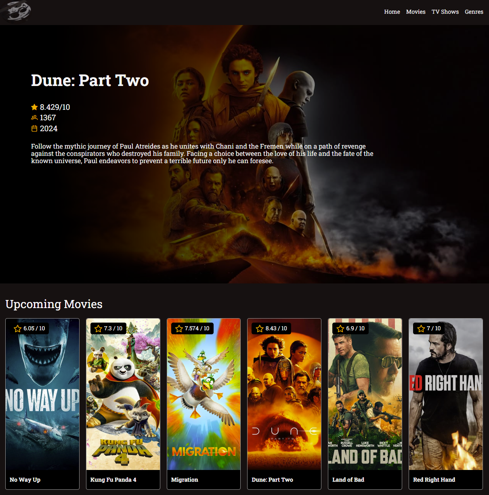
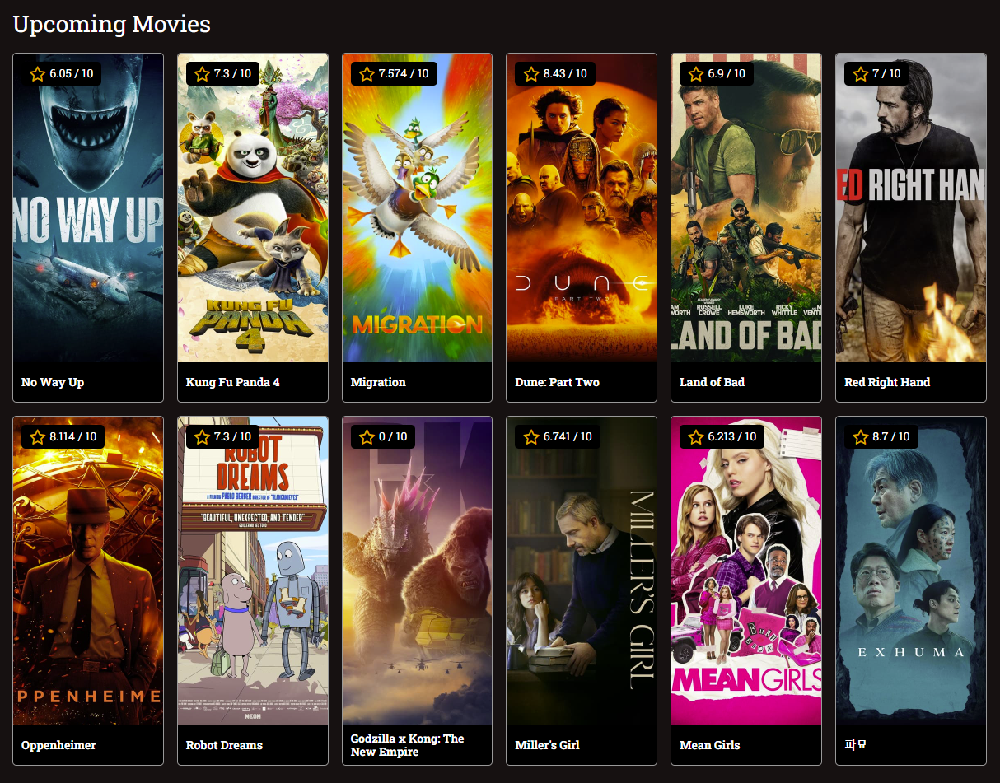
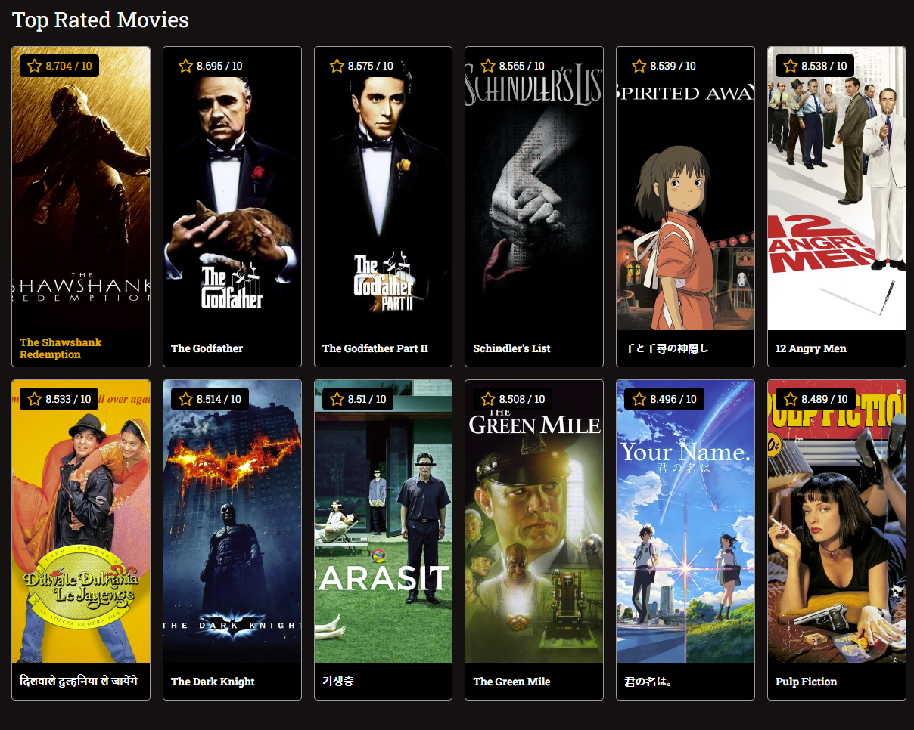
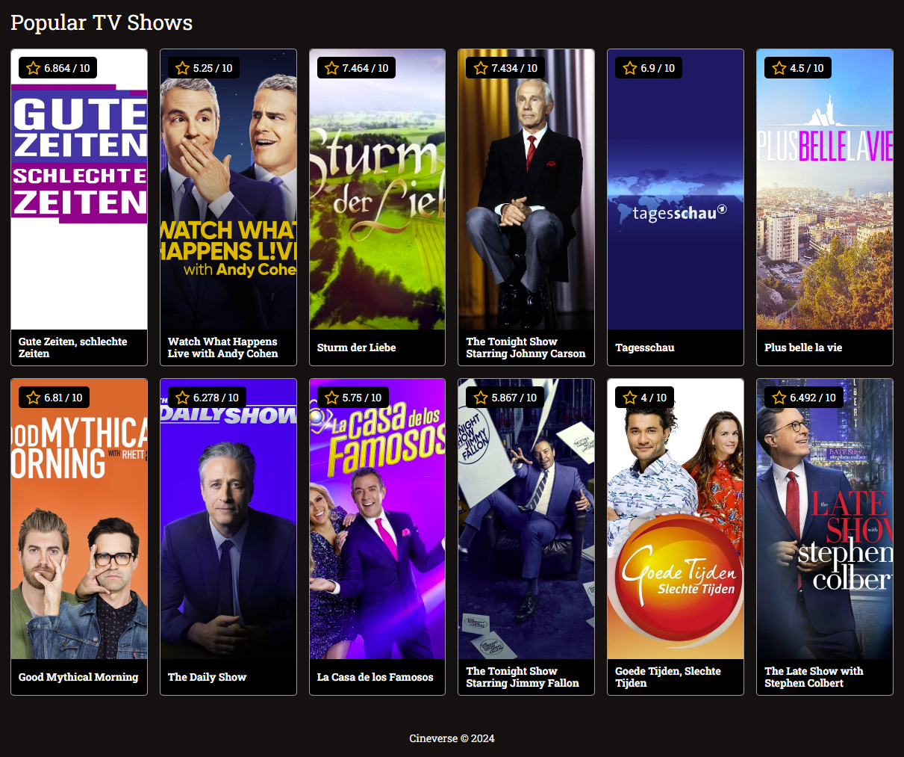
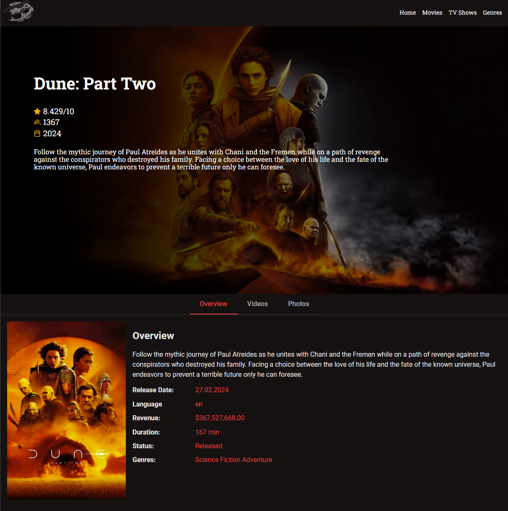
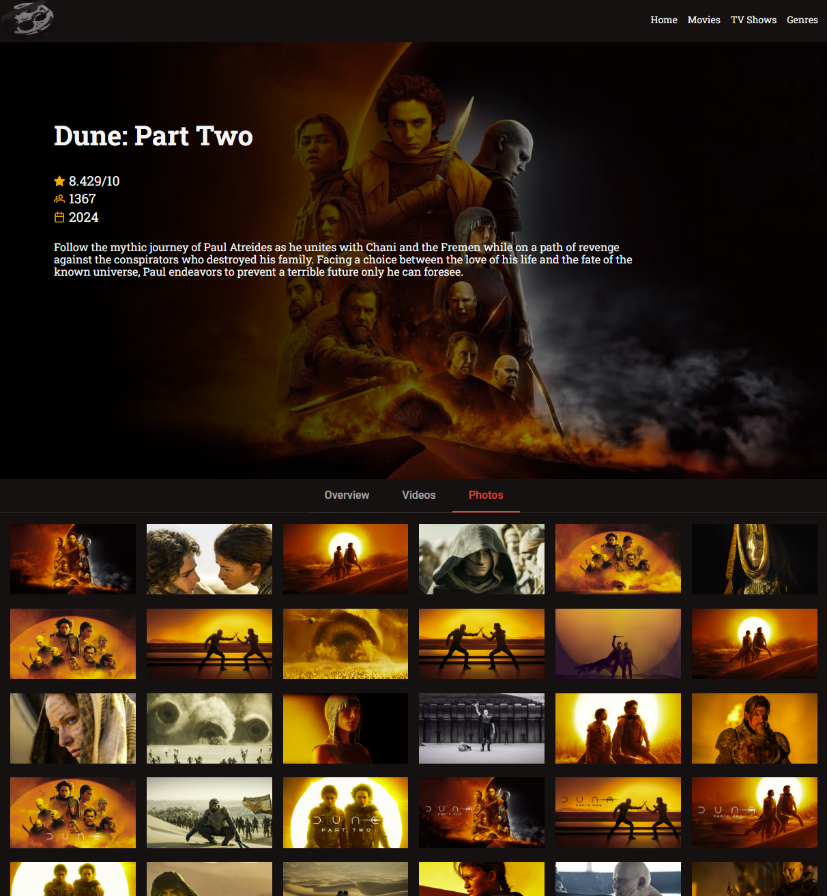

# CineVerse

Angular-based platform. Core functionalities include efficient API integration for real-time data fetching, custom services for streamlined data management, and advanced Angular constructs such as services, async pipes, ngFor, and ngIf for reactive user experiences.

## Development server

Run `ng serve` for a dev server. Navigate to `http://localhost:4200/`. The application will automatically reload if you change any of the source files.

## Screenshots

|  |  |
| ----------------------------------- | ----------------------------------- |
|  |  |
|  |  |

## Favicon

Photo by <a href="https://unsplash.com/@anikamikkelson?utm_content=creditCopyText&utm_medium=referral&utm_source=unsplash">Anika De Klerk</a> on <a href="https://unsplash.com/photos/white-film-strip-dWYjy9zIiF8?utm_content=creditCopyText&utm_medium=referral&utm_source=unsplash">Unsplash</a>
